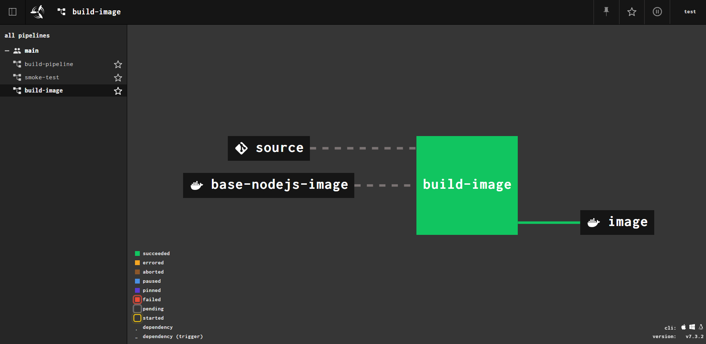
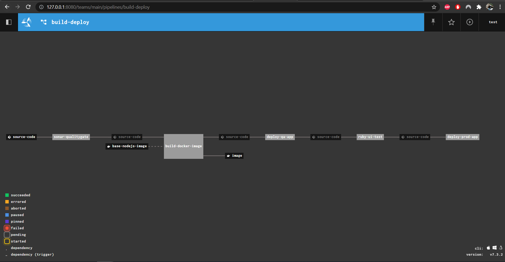

## Book Store Application

This application was developed using NodeJS

## Local execution

1. ```npm install```

2. ```npm start```

this should start the application on http://localhost:5000  

## Remote execution
This application is deployed to heroku as well.

https://simple-book-store-app.herokuapp.com/

## Continuous Integration

Build application docker image with node:16-alpine base image and publish it to docker hub.
https://hub.docker.com/repository/docker/hariprakashohio/my-node-js-app

The below pipeline to run on every code change made to the repository.



